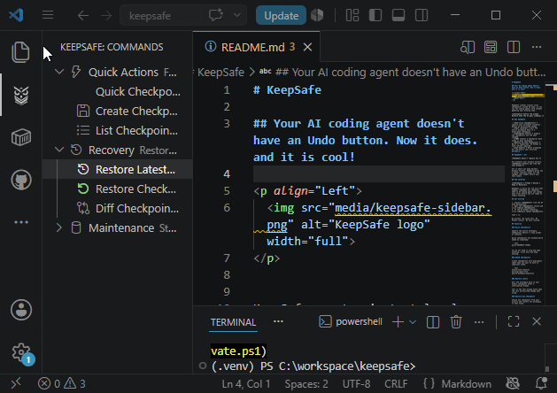
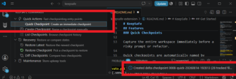
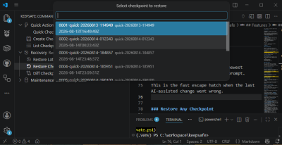
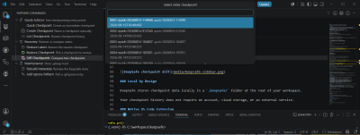
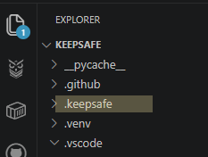

# KeepSafe

## Your AI coding agent doesn't have an Undo button. Now it does. and it is cool!

<p align="Left">
  
</p>


KeepSafe Is like an Undo button, but for thousands of files at once.

**Checkpoint before the prompt. Restore when the AI goes sideways.**

## Why KeepSafe

- **Native VS Code extension** — It just works, no configuration for other interpreters necessary. 
- **One-click checkpoints** — Capture your workspace instantly before an AI-assisted change.
- **Fast restore** — Like CTRL-Z, but for thousands of files at once. Roll the entire workspace back to a known-good checkpoint. 
- **Checkpoint diffs** — Compare two checkpoints and see what changed.
- **100% local** — Checkpoint data stays in your workspace.
- **Git-aware** — Works alongside Git and honors your existing `.gitignore`.

## KeepSafe + Git Partners in Protections

**KeepSafe doesn't replace Git.**

Git protects your project history.  
**KeepSafe protects you from the last prompt.**

KeepSafe protects your work between commits. Git preserves it once it’s ready to keep.

## The workflow

**Checkpoint → Prompt → Review → Keep or Restore**

Built by a developer who codes every day to solve a problem no existing tool handled, KeepSafe was designed from the start to fit a real development workflow.

## Get Started

1. Install **KeepSafe** from the VS Code Marketplace.
2. Open the **KeepSafe** shield and click **Quick Checkpoint**.
3. If the AI breaks something, click **Restore Latest Checkpoint**.
4. Get coffee.

That's it.

No account. No cloud sync. No Python install. No Java runtime.

## Features

### Quick Checkpoints

Capture the entire workspace immediately before a risky prompt or refactor.

Quick checkpoints are automatically named by timestamp:



You do not need to stop and name anything. Click once and keep working.

### Named Checkpoints

Create checkpoints with meaningful names when you want to mark an important state:

```text
before-auth-refactor
working-login-flow
before-database-migration
```

### Restore Latest

Roll the workspace back to your newest checkpoint after a confirmation prompt.

This is the fast escape hatch when the last AI-assisted change went wrong.


### Restore Any Checkpoint

Choose any checkpoint from your history and restore the workspace to that state.



### Diff Checkpoints

Compare any two checkpoints to see what changed between them.



### Local by Design

KeepSafe stores checkpoint data locally in a `.keepsafe/` folder at the root of your workspace.



Your checkpoint history does not require an account, cloud storage, or an external service.

### Native VS Code Extension

KeepSafe is written in TypeScript and runs directly inside VS Code.

There is no Python runtime, Java runtime, or separate CLI to install and maintain.

### Git-aware

KeepSafe works alongside your existing Git workflow.

Files already excluded by `.gitignore`, along with common build artifacts such as `node_modules`, `dist`, and `__pycache__`, are automatically excluded from checkpoints.

## Commands

All KeepSafe commands are available from the KeepSafe panel or through the VS Code Command Palette with `Ctrl+Shift+P`.

| Command | What it does |
|---|---|
| **Quick Checkpoint** | Snapshots the workspace instantly with a timestamped name such as `quick-20260813-143022` |
| **Create Checkpoint** | Prompts for a name so you can label a meaningful state such as `before-auth-refactor` |
| **List Checkpoints** | Shows all checkpoints with names and timestamps |
| **Restore Latest Checkpoint** | Rolls back to the most recent checkpoint after confirmation |
| **Restore Checkpoint** | Lets you select any checkpoint from history to restore |
| **Diff Checkpoints** | Shows what changed between two checkpoints in the Output panel |
| **Add Ignore Pattern** | Adds a `.gitignore` entry to exclude files from checkpointing |
| **Rebuild Metadata** | Rebuilds the checkpoint index if it gets out of sync |

## Fast checkpoints without duplicating your project

KeepSafe keeps the local checkpoint store compact instead of making a complete duplicate of your workspace every time.

- **Snapshots** are taken every 10 checkpoints and contain full copies of tracked files.
- **Deltas** record only what changed between snapshots.
- **Blobs** are content-addressed and compressed, so identical file contents are stored only once.
- **Ignore rules** prevent `.gitignore` entries and common build artifacts from being checkpointed.

## Storage and `.gitignore`

KeepSafe stores its local recovery data here:

```text
.keepsafe/
```

Add the directory to your project's `.gitignore`:

```gitignore
# KeepSafe local checkpoint store
.keepsafe/
```

This keeps KeepSafe checkpoint data local and out of your repository.

An `example.gitignore` containing this entry is included in the extension's `media` folder.

## Requirements

- **Visual Studio Code 1.90.0 or newer**

## Development / Contributing

```bash
npm install
npm run compile
```

Press `F5` in VS Code to launch the Extension Development Host.

## License

MIT
